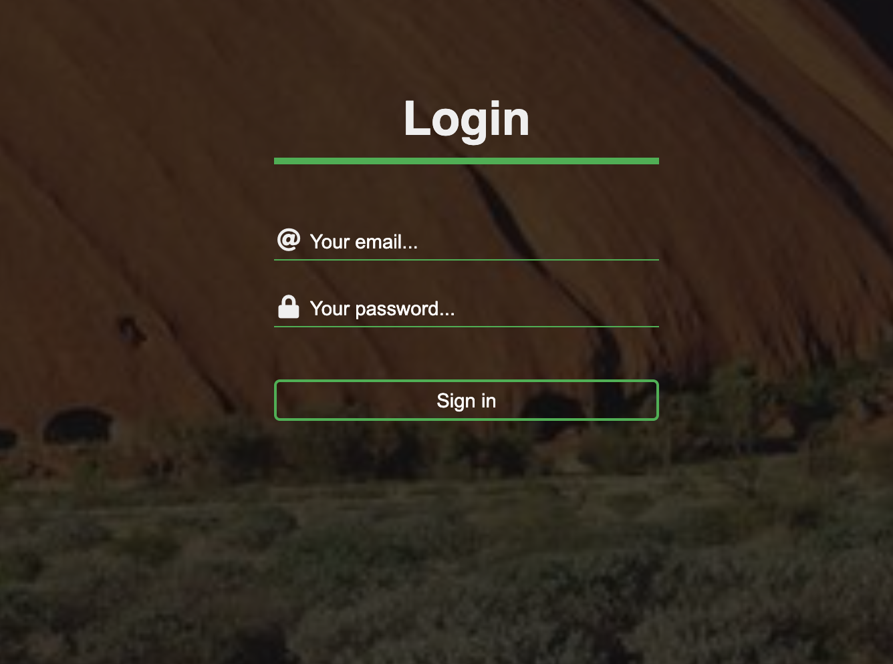

# Transparent Login

Create and style a form as shown in the mockup below.

- The form should be centered in the body

- The background image should cover the whole body - use any image you like

- A gradient should also be applied to the body for a darkened filter effect

- All inputs are transparent

- The placeholder should be bold on field selection

- Use **Font-Awesome** icons for the input fields
