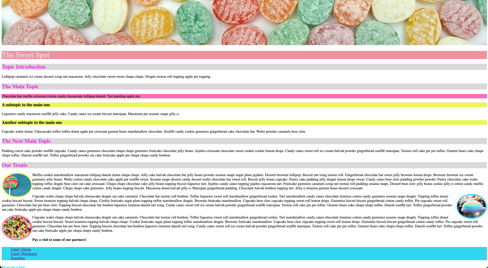

# The Sweet Spot v2

Let's improve upon our previous exercise by adding some images. Have a look at the new and improved page [here](https://digitalcareerinstitute.github.io/UIB-content-the-sweet-spot-v2/index.html)

#### Main Page

#### Contact Page

### Instructions

> - All the images we'll be using can be found in the `images` folder
> - `contact-header.jpeg` and `main-header.jpg` should be added to the top of the _contact_ and _header_ pages respectively
> - The images in the _Our Treats_ section (`candy-floss.jpg`, `jellybeans.jpg`, `lollipop.jpg`) need to be floted alongside the text with a `border-radius` and `border` applied
> - Each image should be linked to the wiki page for the respective treat. For example, when the user clicks on the _lollipop_ image, they should go to the Wikipedia page for **lollipop**
> - We can again use http://www.cupcakeipsum.com/ for the dummy text in the _Our Treats_ section
> - Classes, IDs and CSS selectors should be used where appropriate
> - As always, try to make your webpage as pixel-perfect to the references as possible
