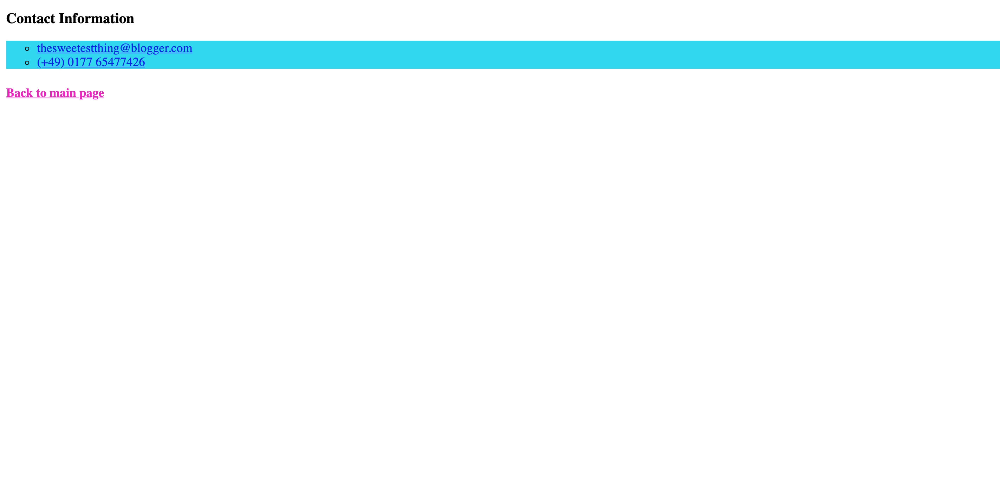

# The Sweet Spot

Create the webpage as shown in the reference images below -

#### Main Page

#### Contact Page

### Instructions

> - Use http://www.cupcakeipsum.com/ for the dummy text
> - Use hex codes to replicate the colors as accurately as possible
> - Classes, IDs and CSS selectors should be used where appropriate
> - You will need to use the pseudo classes `:hover`, `:active` and `:visited`
> - The text under the two **subtopic** headers changes color on `:hover`
> - The links at the bottom of the main page and under **Contact Information** are in lists and change color on `:hover`
> - The web links have an `:active` class applied and should open in a new tab
> - `:visited` pseudo classes should be applied to the internal links, **Drop me a line!** and **Back to main page**

### For further reference, you can check out the live version [here!](https://digitalcareerinstitute.github.io/UIB-content-the-sweet-spot/index.html)
