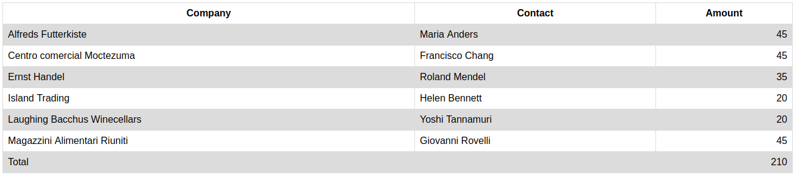

# Basic Data Exercises

## Exercise: Table 2

**Instructions**:

1.  Create a basic HTML page with all important elements.
2.  Look at the mockup file and create the following table with 3 columns.

| Company                       | Contact          | Amount |
|-------------------------------|------------------|--------|
| Alfreds Futterkiste           | Maria Anders     |     45 |
| Centro comercial Moctezuma    | Francisco Chang  |     45 |
| Ernst Handel                  | Roland Mendel    |     35 |
| Island Trading                | Helen Bennett    |     20 |
| Laughing Bacchus Winecellars  | Yoshi Tannamuri  |     20 |
| Magazzini Alimentari Riuniti  | Giovanni Rovelli |     45 |
| Total                         |                  |    210 |

3.  Style it with zebra stripes using pseudo child selectors.
4.  Do NOT use deprecated HTML attributes. Style using CSS.

