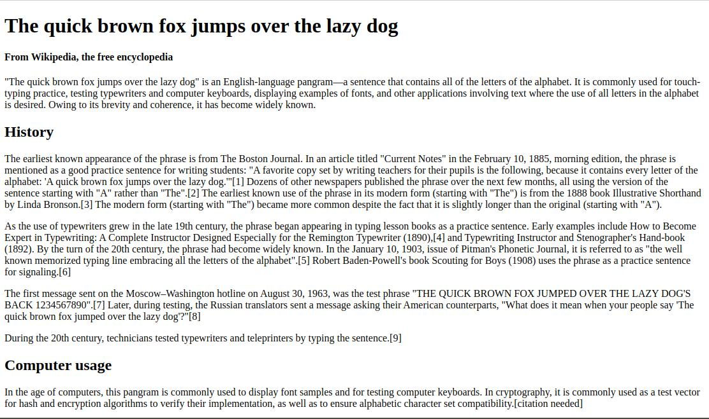

# UIB-content-text

1. Open your favorite Wikipedia Article
2. Turn it into a HTML webpage with correct headings and paragraphs where its appropriate
3. See the example image for how it should look like. 

