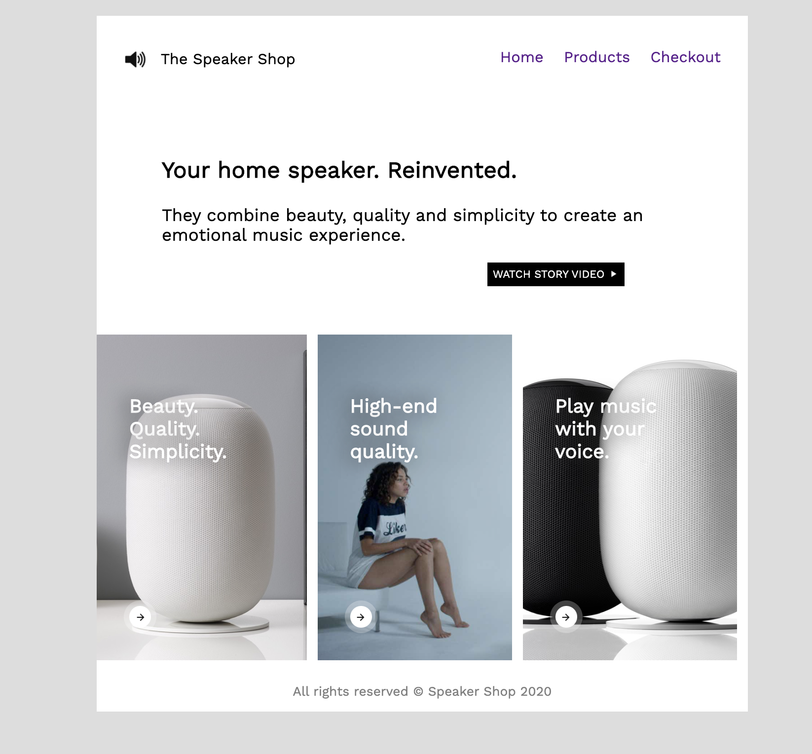

# Speaker Shop Design
Utilising Flexbox, positioning and principles of UI/UX design, your task is to recreate the mock-up below as accurately as possible.

### Design mock-up

### Extras

- Make the page fully responsive
- Create and link more pages
- Publish the page using **Github Pages** and `gh-pages` branch

Font: *Work Sans* from **Google Fonts**

