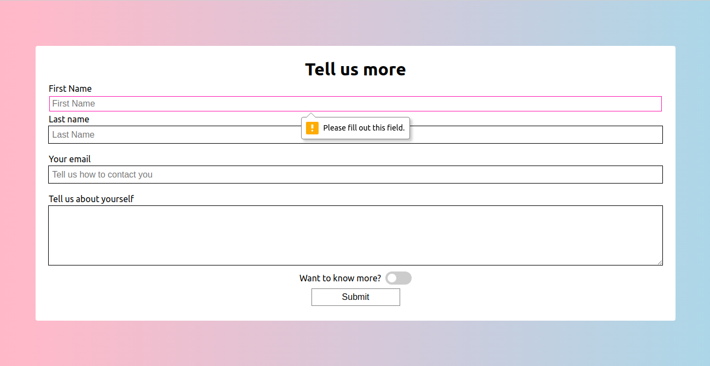

# Validate that Swagger

**Instructions**: 

* Add a minimum length to the first name, last name and email address inputs.
* Add a maximum length to the text field.
* Make the first name, last name, email and message fields required in order to submit the form. 
* Remove the `disabled` attribute from submit.
* Allow users to submit a form using `formspree.io`. 

**Note**: Make sure that you are using your own unique form id from `formspree.io` in the HTML for the solution to work.