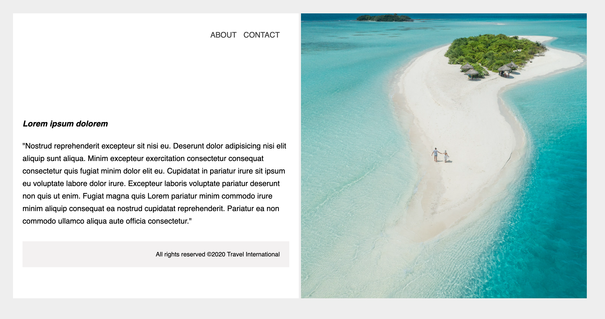

# Travel Webpage

You will create a simple travel agency page with text and an image

### Design Mock-up

- You should use the `background-image` property
- As always, make your webpage pixel-perfect to the reference image
- **ABOUT** and **CONTACT** should have a heavier `font-weight` on `:hover`
- As a bonus, link other pages in the navigation
