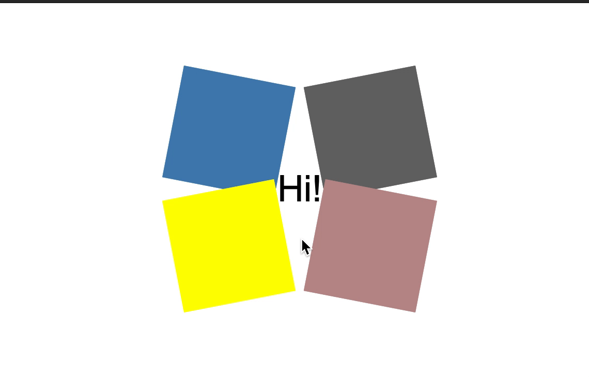

# Secret Unfolds

Create an animation that works like the example shown below.

### Tips

- `transform`

- `relative` and `absolute` positioning will be useful here

- If you want to use the same colors in the example, they are `steelblue`, `dimgray`, `rosybrown`, `yellow`

### Bonus!

- Try altering the animation by adding four additional boxes

- Experiment with `transition-delay`

Good luck and have fun!
