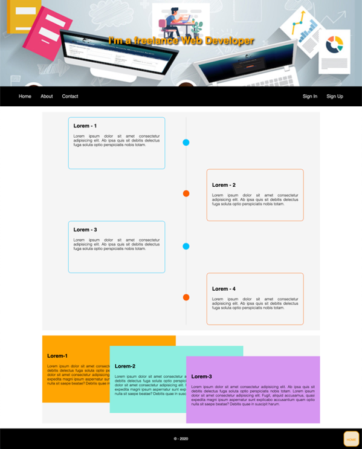

# Freelance Position

Let's take advantage of positioning and Flexbox to recreate the reference image below -

## The online version

In order to see live version, just [click...!](https://hsnakk.github.io/UIB_Layout_Position_Exercise-1/)

### Keep in Mind

- The **HOME** button is always in the same position, as shown in the online version
- The three cards at the bottom change their `z-index` on `:hover`
- `::before` and `::after` pseudo-elements will be useful to create the four dots in the main section ;)

Good luck and have fun!
